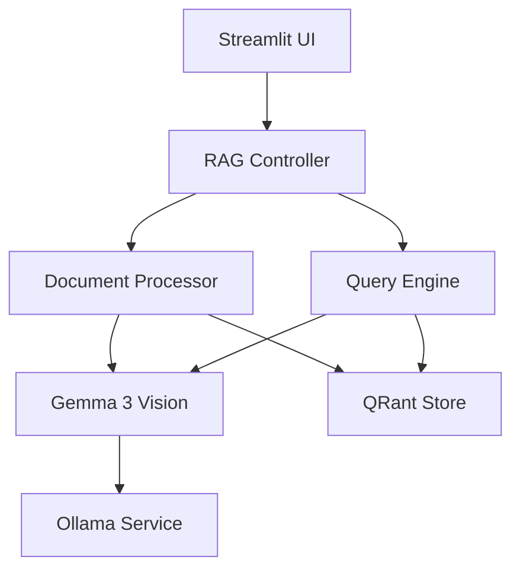
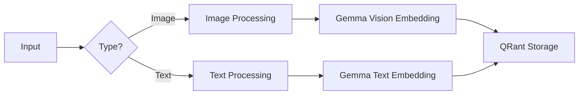
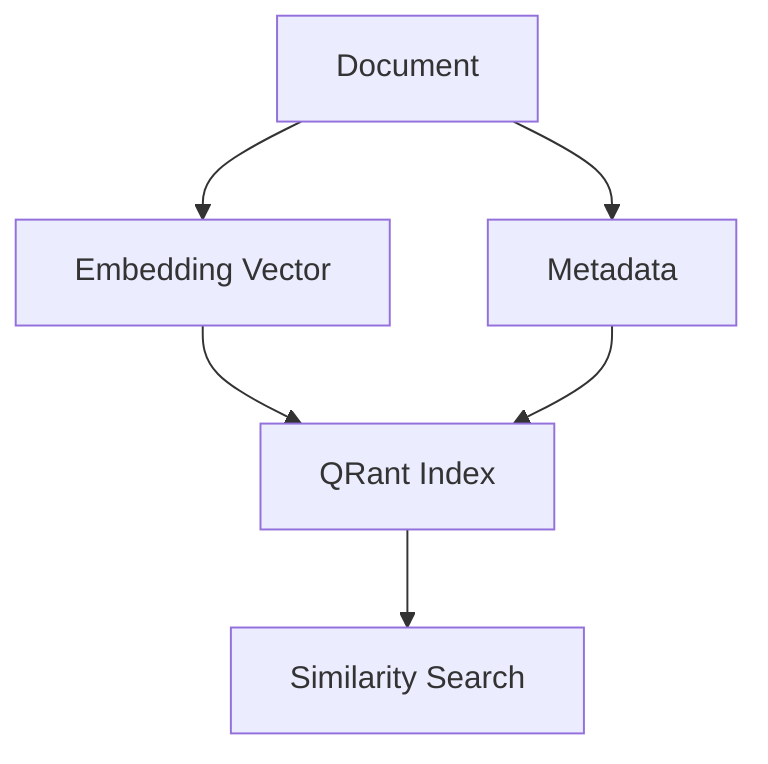
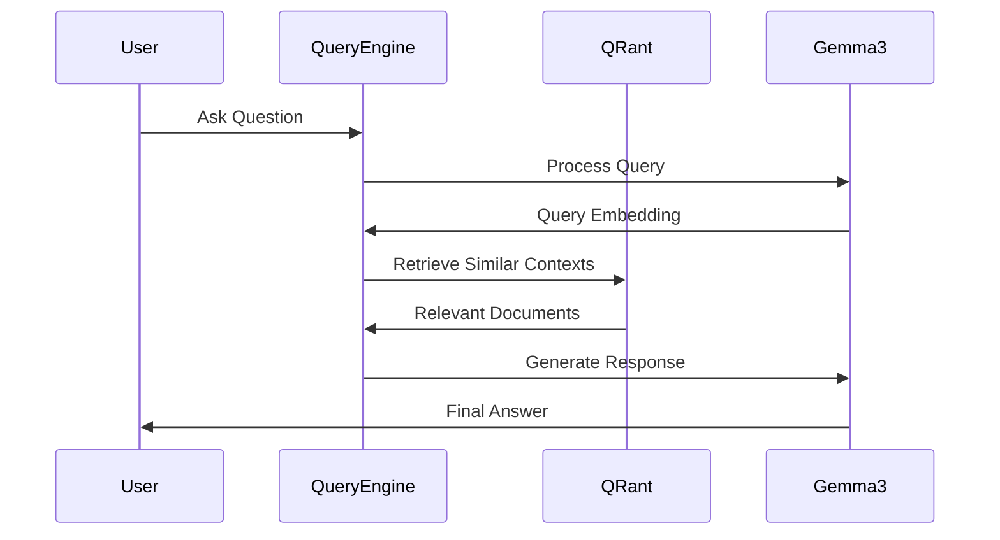
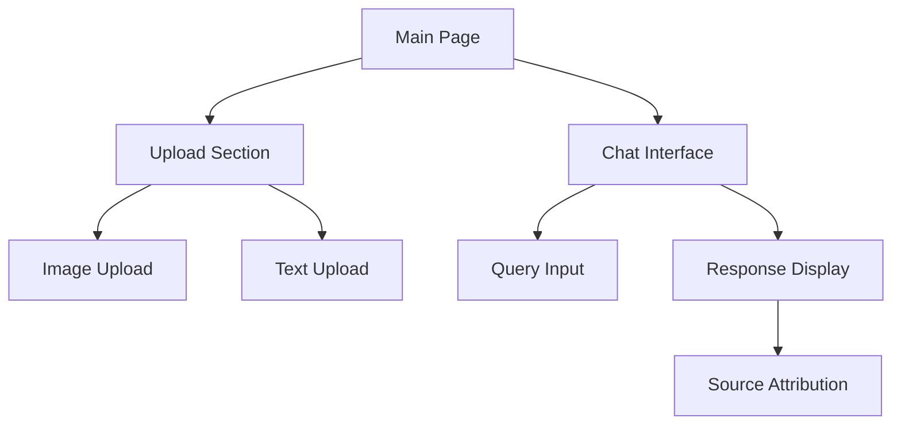

# Multi-Modal RAG Application with Gemma 3

## Architecture Overview

## Detailed Component Design

### 1. Multi-Modal Processing

**Image Processing Pipeline:**
- Direct image input to Gemma 3's vision encoder
- Automatic caption generation
- Visual feature extraction
- Cross-modal embedding generation

**Text Processing Pipeline:**
- Text preprocessing
- Semantic chunking if needed
- Text embedding generation

### 2. Storage System (QRant)

**Storage Structure:**
- Unified vector space for both image and text embeddings
- Metadata storage for source tracking
- Efficient cross-modal retrieval

### 3. Query Processing

**Query Flow:**
1. User input processing
2. Cross-modal context retrieval
3. Context-aware response generation
4. Source attribution

## Technical Specifications

### Gemma 3 Integration
- Model: Gemma 3 with vision capabilities
- Hosting: Local deployment via Ollama
- Input Processing:
  * Images: Direct vision encoding
  * Text: Native text processing
  * Multi-modal queries: Combined understanding

### QRant Configuration
- Index Type: Unified cross-modal vectors
- Distance Metric: Cosine similarity
- Storage: Local disk-based persistence
- Batch Processing: Supported for bulk ingestion

### Streamlit Interface

## Implementation Strategy

### Phase 1: Core Setup
1. Ollama environment configuration
2. Gemma 3 model initialization
3. Basic QRant store setup

### Phase 2: Processing Pipeline
1. Image processing integration
2. Text processing pipeline
3. Cross-modal embedding generation

### Phase 3: Query System
1. Multi-modal query handling
2. Context retrieval optimization
3. Response generation tuning

### Phase 4: UI Development
1. File upload interface
2. Chat system implementation
3. Response visualization

## Performance Considerations
- Batch processing for multiple documents
- Caching of embeddings
- Efficient cross-modal retrieval
- Local resource optimization

## Error Handling
- Input validation
- Model fallback strategies
- Storage consistency checks
- User feedback mechanisms